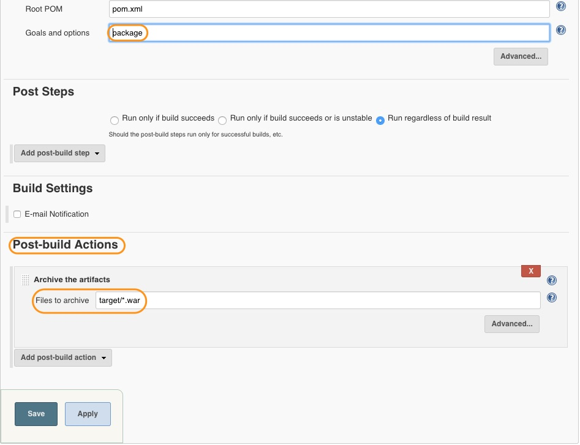

# Creating a Package jobs

In the previous chapter, we have learnt about SonarQube. In this chapter, we will learn about how to package our application.

Just like other maven jobs, Create a new job called *Package*, which is a **copy of test job**, and click on OK.

Then, Change the Build trigger to *Build after other projects are built*. This project should be built **after SonarQube Static Code Analysis Job**.

In the *Build step*, set **package -Dmaven.test.skip=true** as the maven goal.

The most important step in this chapter is the **Post-build Action**.

Select **Archive the artifacts** from the drop down menu.

In **Files to archive** section, set *target/*.war* as a value.

----
:point_left:[**Prev** Chapter 11: Static Code Analysis with SonarQube](https://github.com/schoolofdevops/learn-jenkins/blob/master/Continuous-Delivery/chapters/110_static_code_analysis_with_sonarqube.md)

:point_right: [**Next** Chapter 13: Deploy Application to Tomcat Job](https://github.com/schoolofdevops/learn-jenkins/blob/master/Continuous-Delivery/chapters/130_deploy_to_tomcat.md)
