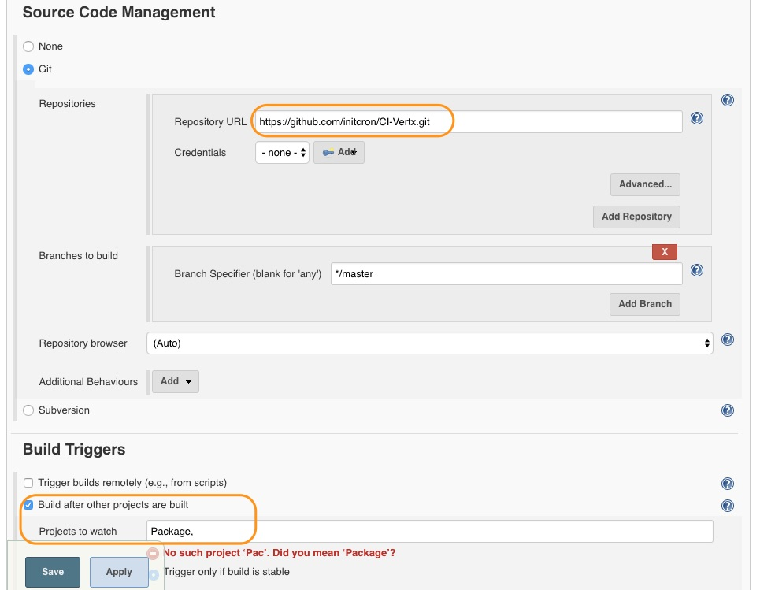
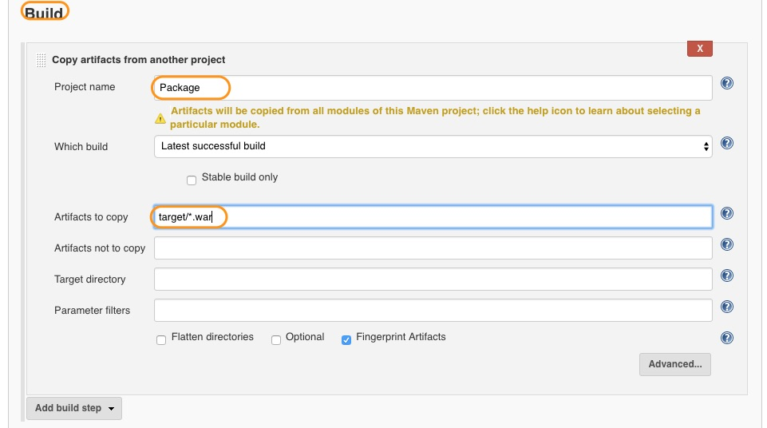
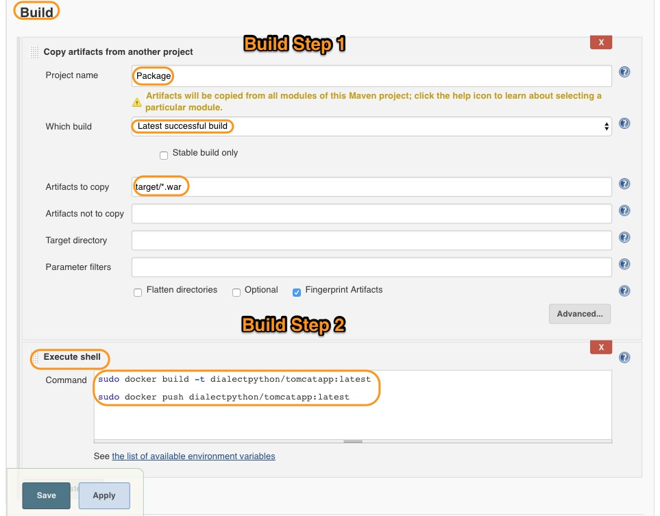

# Create a Docker Image With Our Application

Now our application is ready to be used as a result of successful Package job run. In this chapter, we are going to...

* Copy the artifact from the package job  
* Build a Docker image with our application in it.

## Pre-requisites
(**Note: Visit hub.docker.com and create a DockerHub account if you don't have one already.**)

### Requisite 1

#### Install Copy Artifacts Plugin

* Before creating this job, please install **copy artifacts plugin** which is also a prerequisite.


### Requisite 2

#### Fork the docker repository

* Fork the following repository.

```
https://github.com/initcron/CI-Vertx.git
```

* This repository consists of one **Dockerfile** which you need to update.

* Let us see what this Dockerfile does,

### Requisite 3

#### The Dockerfile

* The Dockerfile is very simple and has only three steps.

```
FROM tomcat:latest
ADD target/CMADSession*.war /usr/local/tomcat/webapps/cmad.war
ADD setenv.sh /usr/local/tomcat/bin/setenv.sh
```

`Line 1`

```
FROM tomcat:latest
```

We are building our image with *official tomcat* image as a **Base image**.

`Line 2`

```
ADD CMADSession*.war.war /usr/local/tomcat/webapps/cmad.war
```

Here we copy our application from the host to container.

`Line 3`

```
ADD setenv.sh /usr/local/tomcat/bin/setenv.sh
```

Like the previous step, we add a script inside the image. The purpose of this script is to decrease the launch time of the application.

### Requisite 4

#### Login to Dockerhub

* Before running the job, we need to do one more thing.

* In your docker host, run the following command.

```
docker exec -it jenkins bash

sudo docker login

(You will be asked for Username and Password)

username: <YOUR_DOCKER_ID>

password: <YOUR_PASSWORD>
```

* After this, you can just press **Ctrl + c** and exit out of the container.

## Docker-Image Job

* This time create a *freestyle project* named **Docker-Image**.

* In *Source Code Management* step, add the following git repository.

```
https://github.com/initcron/CI-Vertx.git
```

This repository has a Dockerfile and a script file (Just to set a Java opts property) in it.

* In *Build Trigger*, add **Package** as a trigger.



* Click on apply project for now.

### Build Environment


This job requires workspace to be cleared before it runs. So,

* In *Build Environment step*, Select **Delete workspace before build starts** then click on **Advanced**.

* In *Patterns for files to be deleted* section, click on **Add**.

* In the second field add **target/*.war** as a pattern.

### Copy the artifact from Package



* In *Build Step*, **Copy artifacts from another project** from the drop down list.

* In *Project name*, Type **Package**.

* Select **Latest successful build** in the next section.

* In *artifacts to copy section*, type **target/*.war**

* This will copy our application from Package job to Docker-Image job.


<<<<<<< HEAD
### Let's Build the Image
=======
## Build the Docker Image

### Dockerfile

* Before we build our Docker image, let us see what this Dockerfile does.

* It is very simple and has only three steps.

```
FROM tomcat:latest
```

We are building our image with *official tomcat* image as a **Base image**.

```
ADD *.war /usr/local/tomcat/webapps/cmad.war
```

Here we copy our application from the host to container.

```
ADD setenv.sh /usr/local/tomcat/bin/setenv.sh
```

Like the previous step, we add a script inside the image. The purpose of this script is to decrease the launch time of the application.

You will also have to create **setenv.sh** with the following content

```
# Fast up the server boot process
export JAVA_OPTS="$JAVA_OPTS -Djava.security.egd=file:/dev/./urandom"
```


## Let's Build the Image
>>>>>>> upstream/master


* This job has **one more** *Build step*.

* Select **Execute shell** from the drop down menu and put the following content.

```
sudo docker build -t <YOUR_DOCKER_ID>/<YOUR_IMAGE_NAME>:latest .

sudo docker push <YOUR_DOCKER_ID>/<YOUR_IMAGE_NAME>:latest
```

Replace **<YOUR_DOCKER_ID>** and **<YOUR_IMAGE_NAME>** with your own values.

* Your build steps should look like this.



* Then click on **Save**.

* Now you can **run the Docker-Image job**

If everything goes well, this job will create a Docker image and push it to DockerHub registry.

----
:point_left:[**Prev** Chapter 12: Creating Package  Job](https://github.com/schoolofdevops/learn-jenkins/blob/master/Continuous-Delivery/chapters/120_create_package_job.md)

:point_right: [**Next** Chapter 14: Deploy application Using Docker Compose ](https://github.com/schoolofdevops/learn-jenkins/blob/master/Continuous-Delivery/chapters/140_Deploy_with_Docker_compose.md)
