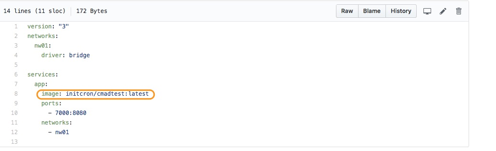
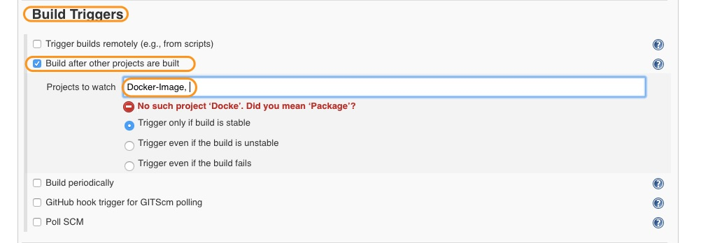
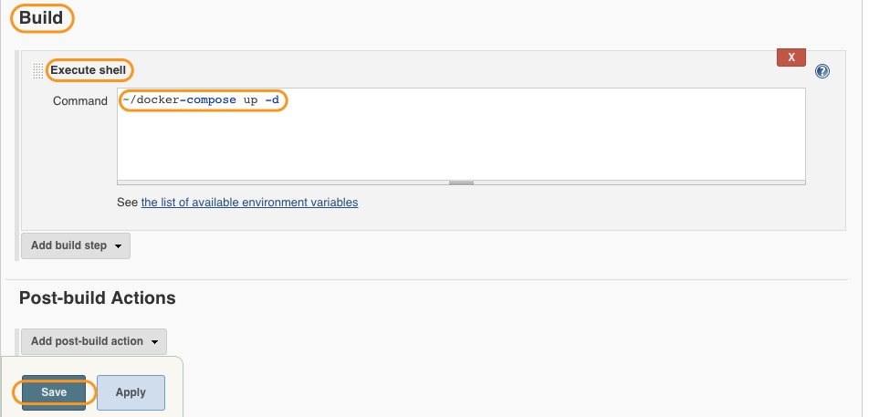

# Deploy with Docker-Compose

In the previous chapter we have created our Docker image and pushed it to the Dockerhub registry.
Now, we will deploy our application using **docker-compose**.

## Pre-requisite

### Docker Compose Installation

Before we create our Deploy job, we need to *install Docker-Compose*. To do that, log in to **jenkins container** and perform the following commands.

```
docker exec -it jenkins bash

curl -L https://github.com/docker/compose/releases/download/1.12.0/docker-compose-`uname -s`-`uname -m` > ~/docker-compose

chmod +x ~/docker-compose

~/docker-compose
```

### Docker-Compose file Edit

Then fork the following Git repository.

```
https://github.com/initcron/CI-Vertx.git
```

This repo consists of one docker-compose file.


**Edit** this file. **Replace YOUR_DOCKER_ID/IMAGE_NAME:TAG** with your own values.

For me it looks like this. (**Note: This is my image name. Do not use this**)




## Create a Deploy Job


* Create a freestyle job called **Deploy**.



* In *Source Code Management* step, add the following git repository.

```
https://github.com/initcron/CI-Vertx.git
```

This repository has a docker-compose file.

* In *Build Trigger*, add **Docker-Image** as a trigger.



* In Build step, add **Execute Shell** as a build step and put the following content.

```
~/docker-compose up -d
```

* Finally click on save.

----
:point_left:[**Prev** Chapter 14: Docker Hub Registry Job](https://github.com/vijayboopathy/CI-Vertx-Doc/blob/master/Continuous-Delivery/chapters/130_create_docker_image.md)
