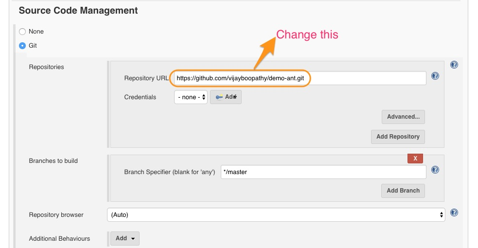
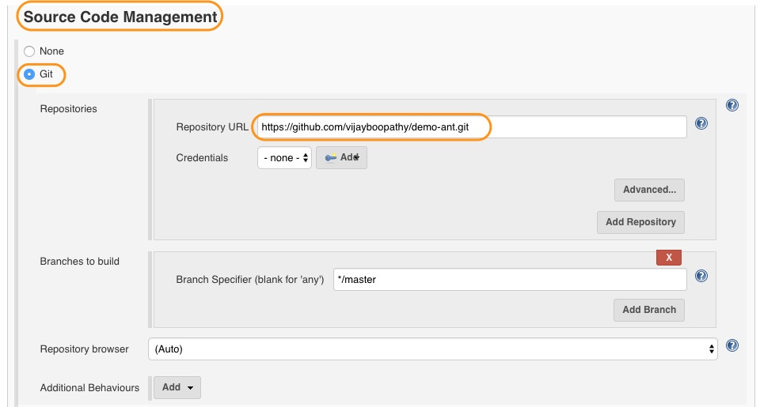
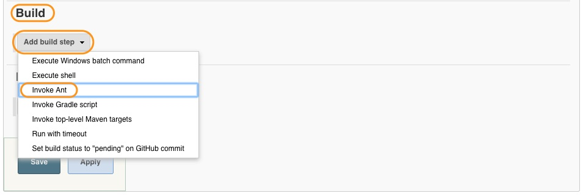
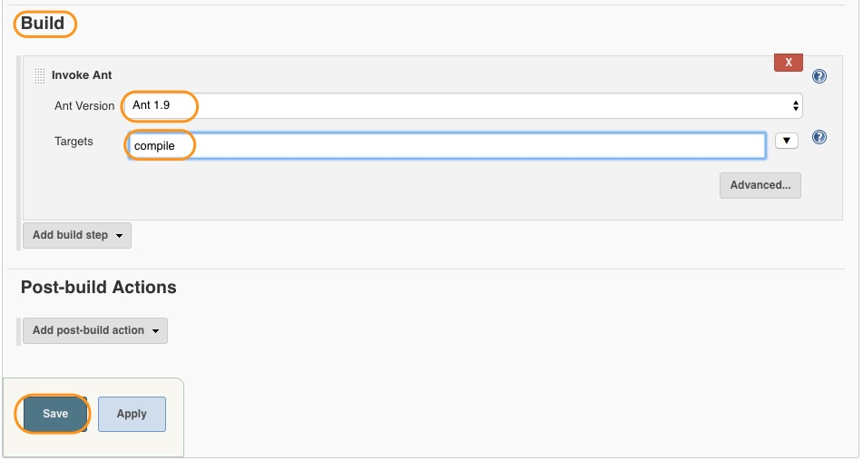

# Creating  Build Job for a Java Project

In this chapter, we are going to create a job to build/compile a sample java application with maven.

## Pre-requisites

### Requisite 1 - Fork the source code

* Before we begin to create our build job, we need to get our source code ready. **Fork** the following repository which contains our source code.

```
http://github.com/schoolofdevops/demo-ant
```



* You will be making some changes in this repo in the upcoming chapters.

## Creating Ant Project

Before we start to create our build job, we need to install **Ant** plugin.


To create a build project,

* From New Item, select **Freestyle Project** and provide it a name e.g. "build".

* And also if you are using Jenkins as a service on the host (installed using a deb file or using package manager), you need to install git and docker as well.

```
sudo apt-get install git
sudo apt-get install docker-engine
```


* From the configuration screen, scroll to Source Code Management, select GIT and provide repository URL of **Your Repository**

```
e.g. http://github.com/schoolofdevops/demo-ant
```



From **Build Triggers** select **Poll SCM**. Lets configure it to poll every 5 minutes using the following schedule

```
H/5 * * * *
```


* Scroll down to Build step and you have to select **invoke Ant** option from the drop down menu


* Then you have to select **Ant version** that we have configured earlier and provide target as **build**



In addition to compile, following are the targets an Ant project could take.

1. clean - Clean up the build directory
2. compile - compile source code
3. test - unit tests
4. jar/war/package - build jar/war
5. javadoc - Create JavaDoc comments from the Java code

* Save the job and click on **Build Now**.  Following is a snippet from the output of the build job.

```
Buildfile: /var/jenkins_home/workspace/ant-build/build.xml

init:

compile:
    [javac] /var/jenkins_home/workspace/ant-build/build.xml:16: warning: 'includeantruntime' was not set, defaulting to build.sysclasspath=last; set to false for repeatable builds

BUILD SUCCESSFUL
Total time: 0 seconds
Finished: SUCCESS
```
