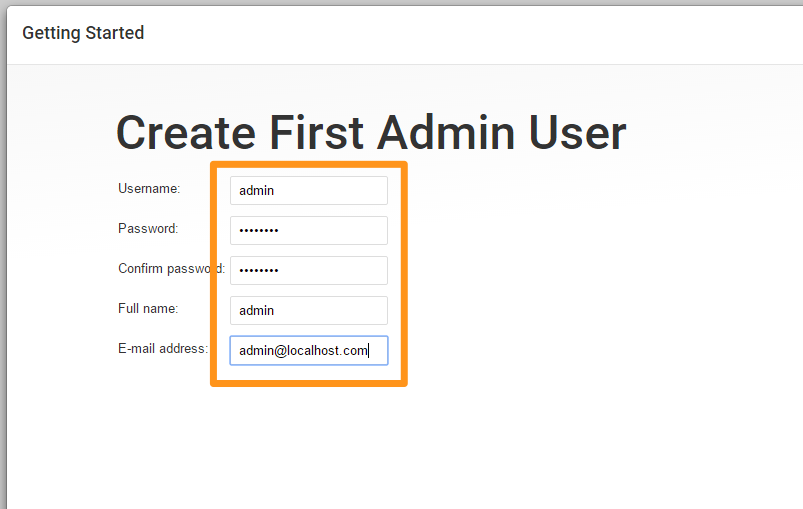

# JENKINS

Jenkins is a essential automation tool to setup Continuous Integration. Its the integrator which helps you build your development,  testing and deployment  workflow and create job pipelines. It also adds visibility to all stake holders including the Dev, QA, Ops teams involved in building, testing and deploying the product.

## Installing Jenkins With Docker

### Installing Docker Engine

Proceed with installing Docker Engine on your choice of Operating System. For details on how to install docker visit the official installation page at  [docs.docker.com](https://docs.docker.com/engine/installation/).

We assume you have installed docker and are ready to launch containers before proceeding. To validate docker environment run.

```
docker ps
```

If the above command goes through without errors, you are all set.

After installing docker, pull our Jenkins docker image from [docker hub](https://hub.docker.com/_/jenkins/).

This is the simplest way of installing Jenkins and requires minimal efforts.

```
docker run -idt --name jenkins  -v /var/run/docker.sock:/var/run/docker.sock  -p 8080:8080 -p 50000:50000 schoolofdevops/jenkins:2.19.4-debian
```

If you install it using the instructions above, find out the IP address and go to http://YOUR_IP_ADDRESS:8080 to access jenkins UI.

After that you have to select install
To start/stop jenkins with docker, use the following commands,

```
docker start jenkins
docker stop jenkins
```

## Common Post Installation Steps

After the installation, you will be asked for password. The password will be saved in the following file.

```
/var/jenkins_home/secrets/initialAdminPassword
```

Password can be also fetched from the logs. You could run the following command to view the password,

```
docker logs jenkins
```

or to follow the logs

```
docker logs -f jenkins

[use ^c to come back to the terminal]
```


Select **Install Suggested Plugins** when given an option. This will install all common plugins such as git, gradle, svn, ssh, pipeline which are quiet handy.

Create Admin user



Now we have successfully installed Jenkins and we can proceed with configurations


-----
:point_left:[**Prev** Chapter 1: Introduction](https://github.com/schoolofdevops/learn-jenkins/blob/vertx-v1/continuous-delivery/chapters/010_introduction.md)

:point_right: [**Next** Chapter 3: Configure Jenkins](https://github.com/schoolofdevops/learn-jenkins/blob/vertx-v1/continuous-delivery/chapters/030_configure_jenkins.md)
