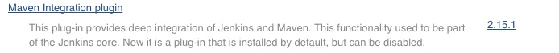
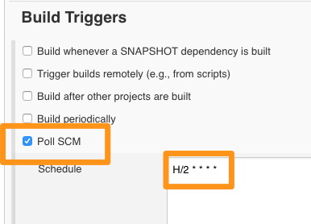

# Creating  Build Job for a Java Project

In this chapter, we are going to create a job to build/compile a sample java application with maven.

## Creating Maven Project

Before we start to create our build job, we need to install **maven-integration** plugin.



To create a build project,

* From New Item, select **Maven Project** and provide it a name e.g. "build".

* And also if you are using Jenkins as a service on the host (installed using a deb file or using package manager), you need to install git and docker as well.

```
sudo apt-get install git
sudo apt-get install docker-engine
```


* From the configuration screen, scroll to Source Code Management, select GIT and provide repository URL

e.g. https://github.com/schoolofdevops/demo


From **Build Triggers** select **Poll SCM**. Lets configure it to poll every 5 minutes using the following schedule

```
H/5 * * * *
```



* Scroll down to Build step and you should see Root POM selected since its a Maven Project. In the Goals and options section, provide **compile** as a goal.


In addition to compile, following are the goals Maven project could take.

1. validate
2. compile - compile source code
3. test - unit tests
4. package - build jar/war
5. integration-test
6. verify
7. install
8. deploy

* Save the job and click on **Build Now**.  Following is a snippet from the output of the build job.

```
[INFO] Compiling 1 source file to /var/jenkins_home/workspace/build/target/classes
[INFO] ------------------------------------------------------------------------
[INFO] BUILD SUCCESS
[INFO] ------------------------------------------------------------------------
[INFO] Total time: 10.216 s
[INFO] Finished at: 2016-04-27T17:11:30+00:00
[INFO] Final Memory: 19M/240M
[INFO] ------------------------------------------------------------------------
Waiting for Jenkins to finish collecting data
[JENKINS] Archiving /var/jenkins_home/workspace/build/pom.xml to com.example.app/maven-app/3.0-release/maven-app-3.0-release.pom
channel stopped
Finished: SUCCESS
```

----
:point_left:[**Prev** Chapter 7: Preparing to build Java  Projects](https://github.com/schoolofdevops/learn-jenkins/blob/master/continuous-delivery/chapters/070_preparing_for_java_builds.md)

:point_right: [**Next** Chapter 9: Integrating with Artifactory](https://github.com/schoolofdevops/learn-jenkins/blob/master/continuous-delivery/chapters/090_resolving_libs_from_artifactory.md)
