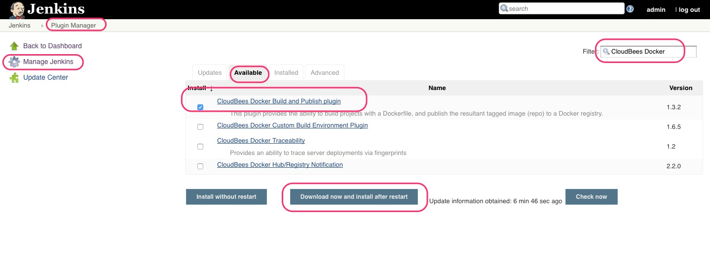
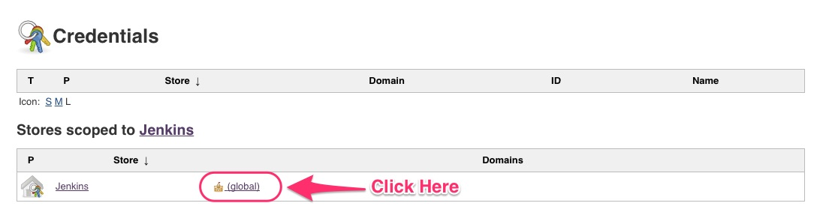
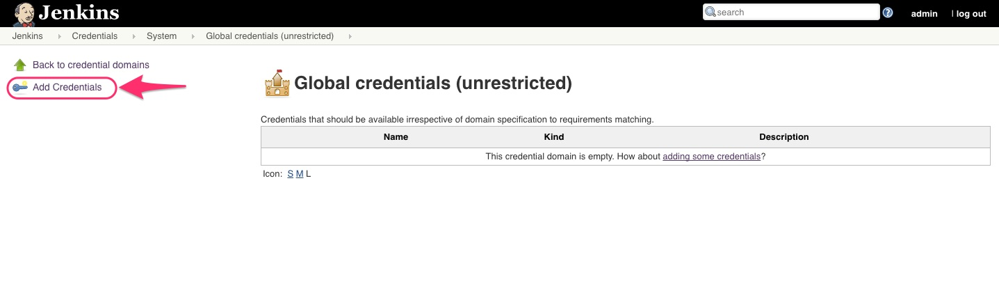
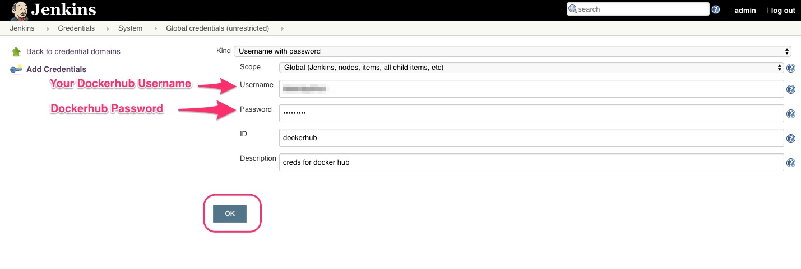
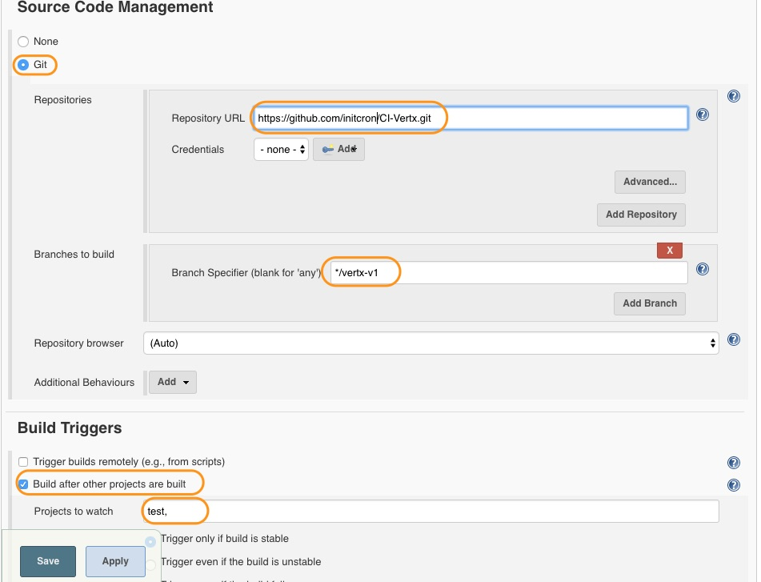
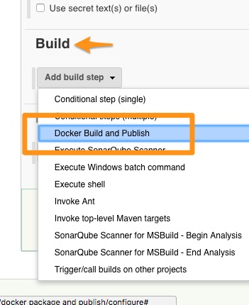
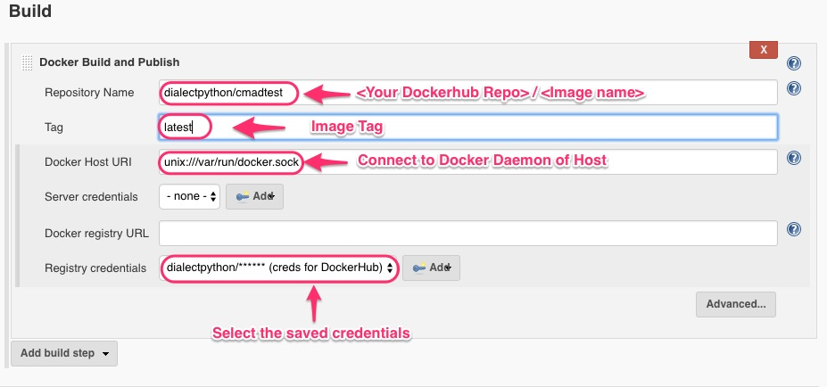

# Create a Docker Image With Our Application

Now our application is ready to be used as a result of successful Package job run. In this chapter, we are going to...

* Build a Docker image with our application in it.

## Pre-requisites
(**Note: Visit hub.docker.com and create a DockerHub account if you don't have one already.**)

### Set up Docker Environment for Jenkins

* Install CloudBees Docker Build and Publish Plugin



* After installing that plugin, go to `Credentials => global(global domain) => Add credentials => fill in the details








* Now go back to Jenkins Main Page


### Pre Requisite 2

#### Write the Dockerfile

* You should have created a Dockerfile by now which should be part of the application source code.
* A sample Dockerfile is as follows

```
FROM schoolofdevops/voteapp-mvn:v0.1.0

USER root

WORKDIR /code

ADD pom.xml /code/pom.xml
RUN ["mvn", "dependency:resolve"]
RUN ["mvn", "verify"]

# Adding source, compile and package into a fat jar
ADD src/main /code/src/main
RUN ["mvn", "package"]
RUN chmod a+rwx target/cmad-advanced-staging-demo-fat.jar

CMD ["java", "-jar", "target/cmad-advanced-staging-demo-fat.jar", "-cluster"]
```

`What this Dockerfile does?`

```
Short Answer:
  This Dockerfile creates a Docker image which has the source code, packaged application and command which will be executed at the start of a container
```

```
Long Answer:
  This Dockerfile uses a custom Docker image (voteapp-mvn) as base. Then we copy the source code. After that we run couple of Maven (dependency resolve and package) commands to get the package. Finally we run java -jar application.jar to get our application up and running.
```

### Requisite 3

#### Login to Dockerhub from inside Jenkins Container 

* Before running the job, we need to do one more thing.

* In your docker host, run the following command.

```
docker exec -it jenkins bash

sudo docker login

(You will be asked for Username and Password)

username: <YOUR_DOCKER_ID>

password: <YOUR_PASSWORD>
```

* After this, you can just press **Ctrl + c** and exit out of the container.

## Create "Build Docker Image" Job

* This time create a *freestyle project* named **Build Docker Image**.

* In *Source Code Management* step, add **YOUR** git repository.

```
eg:
https://github.com/initcron/CI-Vertx.git
```

* In *Build Trigger*, add **Unit Test** as a trigger.



* Click on apply project for now.

## Let's Build the Image

* This job has one *Build step*.

* Select **Docker Build and Publish** from the Build step



* Add the following details in the fields.



* Then click on **Save**.

* Now you can **run the Docker-Image job**

If everything goes well, this job will create a Docker image and push it to DockerHub registry.

----
:point_left:[**Prev** Chapter 11: Static Code Analysis with SonarQube](https://github.com/schoolofdevops/learn-jenkins/blob/vertx-v1/continuous-delivery/chapters/110_static_code_analysis_with_sonarqube.md)

:point_right: [**Next** Chapter 13: Deploy application Using Docker Compose ](https://github.com/schoolofdevops/learn-jenkins/blob/vertx-v1/continuous-delivery/chapters/130_Deploy_with_Docker_compose.md)
