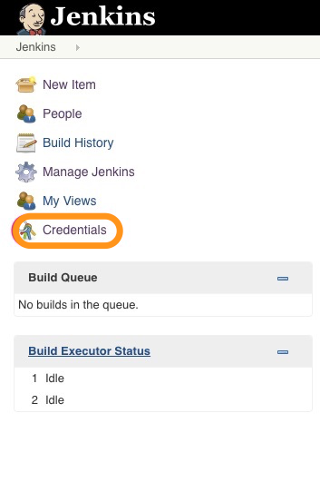
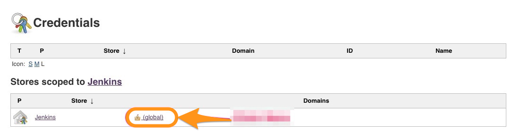
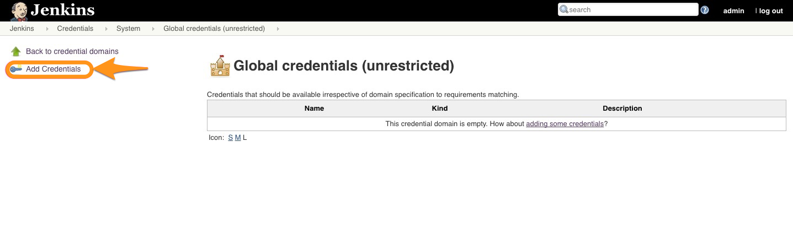

# Create a Docker Image With Our Application

Now our application is ready to be used as a result of successful Package job run. In this chapter, we are going to...

* Build a Docker image with our application in it.

## Pre-requisites
(**Note: Visit hub.docker.com and create a DockerHub account if you don't have one already.**)

### Pre Requisite 1 - Set up Docker Environment for Jenkins

* Install CloudBees Docker Build and Publish Plugin


* After installing that plugin, go to `Credentials => global(global domain) => Add credentials => fill in the details








* Now go back to Jenkins Main Page


### Pre Requisite 2 - Dockerfile

* You should have created a Dockerfile by now which should be part of the application source code.

## Create "Build Docker Image" Job

* This time create a *freestyle project* named **Build Docker Image**.

* In *Source Code Management* step, add **YOUR** git repository.

```
eg:
https://github.com/initcron/demo.git
```

[Replace the above with your own repo URI]

* In *Build Trigger*, add the previous job e.g. **Static Analysis** as a trigger.


* Click on apply project for now.

## Build and Publish Docker Image

* This job has one *Build step*.

* Select **Docker Build and Publish** from the Build step


* Add the following details in the fields.
  * Repository Name (e.g. username/repo)
  * Tag (e.g. staging)
  * Docker Host URI :  unix:///var/run/docker.sock


* Then click on **Save**.

* Now you can **run the Docker-Image job**

If everything goes well, this job will create a Docker image and push it to DockerHub registry.

----
:point_left:[**Prev** Chapter 11: Static Code Analysis with SonarQube](https://github.com/schoolofdevops/learn-jenkins/blob/vertx-v1/continuous-delivery/chapters/110_static_code_analysis_with_sonarqube.md)

:point_right: [**Next** Chapter 13: Deploy application Using Docker Compose ](https://github.com/schoolofdevops/learn-jenkins/blob/vertx-v1/continuous-delivery/chapters/130_Deploy_with_Docker_compose.md)
