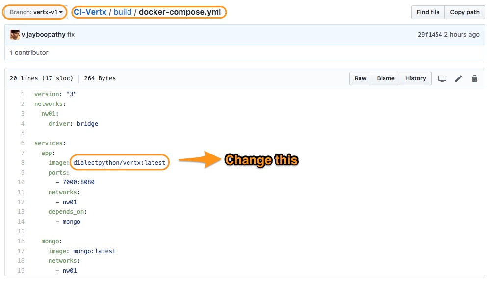
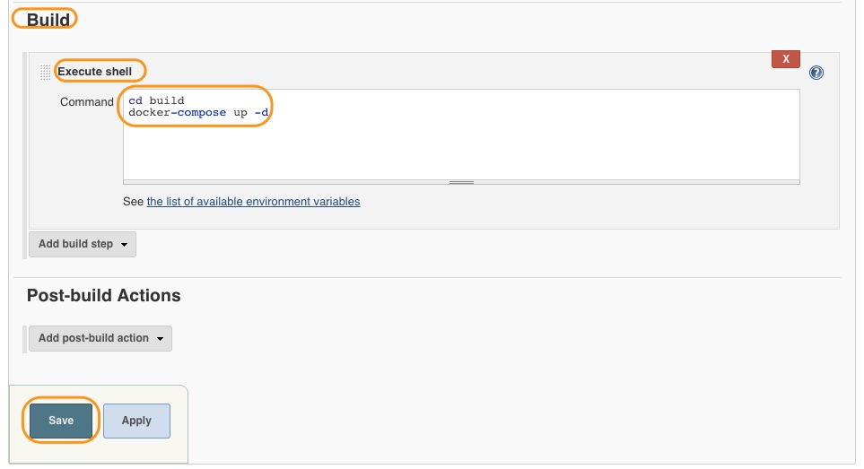

# Deploy to Staging with Docker-Compose

In the previous chapter we have created our Docker image and pushed it to the Dockerhub registry.
Now, we will deploy our application using **docker-compose**.

## Pre-requisite

### Docker-Compose file Edit

Then fork the following Git repository.

```
https://github.com/initcron/CI-Vertx.git
```

This repo consists of one docker-compose file.

```
version: "3"

services:
  app:
    image: <docker-ub-id>/<repo>:latest
    ports:
      - 7000:8080
```


**Edit** this file. **Replace <docker-ub-id>/<repo>:latest** with your own values.

For me it looks like this. (**Note: This is my image name. Do not use this**)




## Create a Deploy Job


* Create a freestyle job called **Deploy**.


* In *Source Code Management* step, add the following git repository.

```
https://github.com/initcron/CI-Vertx.git
```

This repository has a docker-compose file.

* In *Build Trigger*, add **Docker-Image** as a trigger.



* In Build step, add **Execute Shell** as a build step and put the following content.

```
~/docker-compose up -d
```

* Finally click on save.

----
:point_left: [**Prev** Chapter 14: Create Docker Image Job](https://github.com/schoolofdevops/learn-jenkins/blob/master/continuous-delivery/chapters/140_create_docker_image.md)
