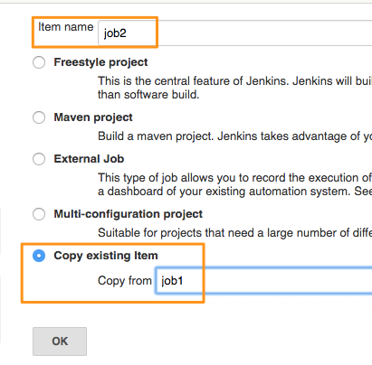
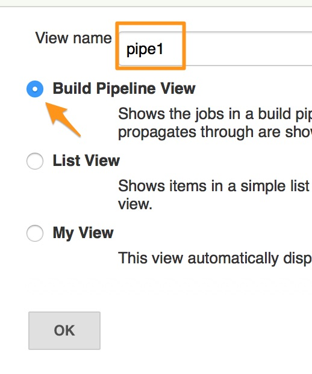

# Chapter 6: Building Jobs Pipeline
## Creating More Jobs to add to pipeline

Lets create 2 more jobs so that we could connect those together to setup a mock build pipeline.

To create new jobs, you could click on create items, name the job and select the last option which says **Copy from Another Job**

For this tutorial, lets create jobs by name **job2** and **job3** which should be copies of job1.  

At the end of this exercise, you should see 3 jobs listed on jenkins dashboard as above.

## Connecting jobs

Lets now create a pipeline by connecting these jobs together. We would create a pipeline with

       job1 => job2 => job3

 Where, job2 should run, only if job1 is built successfully, and should trigger job3 once it builds itself successfully.

We could either define both  connections from job2, or go to job1 and job3 and define its relationship with job2.  We would do the later.

Lets open Job1 configurations and from **Post Build Actions** select **Build Other Projects** and select **job2**

Lets also go to jobs3 and define a dependency on job2. To do so, you would have to scroll to **Build Triggers** section and select **Build after other projects are built** and provide job2.

## Upstreams and Downstreams

Jenkins calls these connections as **Upstreams** and **Downstreams**. In the context of job1, its downstream is job2. And for job2, job1 is its upstream. Same goes with job2 and job3.  This is depicted in the following image which shows the job2 configurations.

## Install Pipeline Plugin

To get a better view of the complete pipeline and the workflow, we would install a plugin which allows us to create a special view for connected jobs.  

To install this plugin,
* From **Manage Jenkins** select **Manage Plugins**
* Click on **Available** tab and start typing "pipeline" int he filter box. No need to press enter
* Check the box against **Build Pipeline Plugin**, the second option, and click on the button at the bottom to "Download and install after restart".
* If you don't see this plugin in the *Available* list then check the *Installed* list to see if it is installed already

## Crete Pipeline View

Lets now create a pipeline view.
* From Jenkins dashboard click on the **+** symbol besides the current list view named **ALL** which displays all jobs.

* Provide a name to the view e.g. **pipe1**, check the radio button for **Build Pipeline View**. Click on ok

From the view configurations, select initial job from the drop down menu and the number of displayed builds.  Click on OK to finish configurations and show the view.  

## Run pipelines

The pipeline view reads the first job, and picks up all the jobs which are directly or indirectly connected showing you one single view of the complete workflow and the order in which it is going to be executed.

Pipeline view also shows the history of job runs up to the number of instances you selected earlier in the configurations.

Go trigger a **Run** from the pipeline view and see what happens. Make sure you have selected "ENABLE AUTO REFRESH" earlier from the top right corner of the screen.

----
[Chapter 5: Adding Build Triggers **Prev**](https://github.com/schoolofdevops/learn-jenkins/blob/master/manuscript/050_add_build_triggers.md) :point_left:

:point_right: [**Next** Chapter 7: Preparing to build Java  Projects](https://github.com/schoolofdevops/learn-jenkins/blob/master/manuscript/070_preparing_for_java_builds.md)
