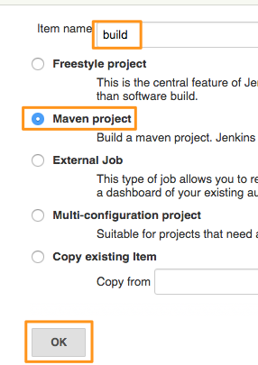
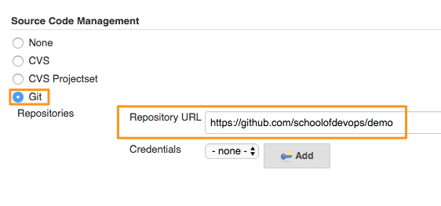

#Chapter 8: Creating  Build Job for a Java Project

In this chapter, we are going to create a job to build/compile a sample java application with maven.

## Creating Maven Project

To create a build project,
* From New Item, select **Maven Project** and provide it a name e.g. "build"



* From the configuration screen, scroll to Source Code Management, select GIT and provide repository URL

e.g. https://github.com/schoolofdevops/demo



From **Build Triggers** select **Poll SCM**. Lets configure it to poll every 5 minutes using the following schedule

```
H/5 * * * *

```


* Scroll down to Build step and you should see Root POM selected since its a Maven Project. In the Goals and options section, provide **compile** as a goal.


In addition to compile, following are the goals Maven project could take.

1. validate
1. compile - compile source code
1. test - unit tests
1. package - build jar/war
1. integration-test
1. verify
1. install
1. deploy


* Save the job and clicl on **Build Now**.
