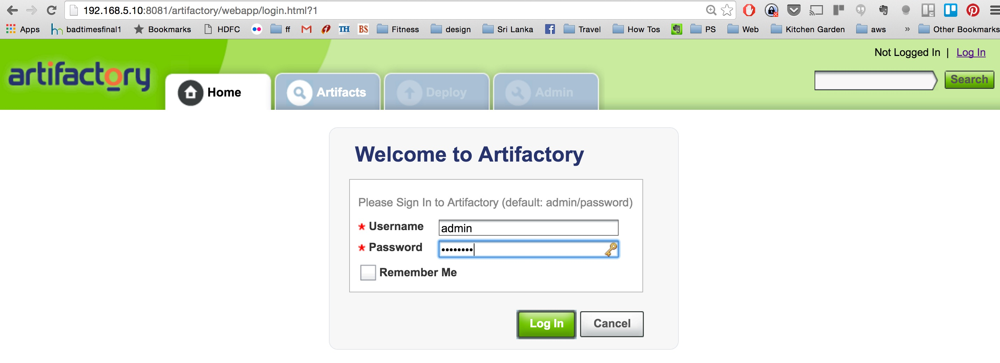
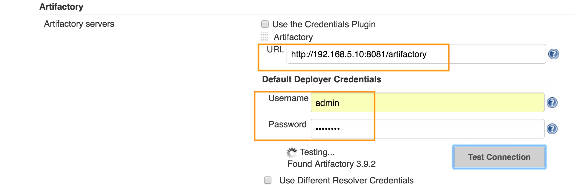

# Using Artifactory To Resolve Artifacts

## Introduction to Artifactory

Following video explains the usefulness of Artifactory to share libraries and artifacts in a collaborated development.

In addition, Artifactory could be used as a local repository for storing rpms, debs, docker images, gems, pythong packages etc.

## Integrating Artifactory with Jenkins

Artifactory could be used for two purposes,
1. Resolving Libraries/Packages From
1. Pushing build artifacts to

In this chapter, we are going to start using Artifactory as a local repository  to resolve libraries from.

In order to connect Artifactory with Jenkins, first step is t install the Plugin.

From Manage Plugins, lets filter by "Artifactory", select the relevant plugin and install it.

Following is a screenshot of the Artifactory console

## Configure Artifactory Plugin
* Manage Jenkins -> Configure System -> Artifactory -> Add
* Add Artifactory details and Test Connection

e.g.
   uri: http://HOSTNAME:8081/artifactory
   port: 9000
   user: admin
   pass: password

