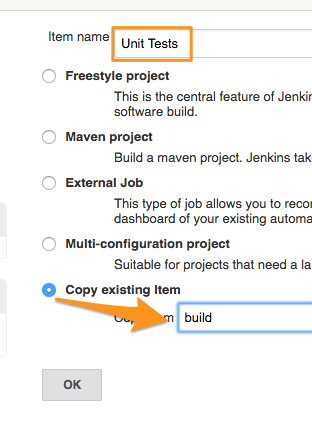

## Creating a Test Job

In the previous chapters we have created a build job and have integrated it with git and artifactory. In this chapter, we would create a job which tests the code after its been successfully compiled.  We would go on to integrate this with Sonarqube later to do static code analysis.

### Create A Job to run Unit Tests

From **New Items** create a new project. Name it as **Unit Tests** and select copy from existing item. Provide "build" as the job name to copy from.

Review Job Configurations

* Provide Description
* Check Resolve Artifacts from Artifactory from Build Environment. Provide the same configurations as build job that we configured earlier to connect with artifactory.
* Review Build Triggers. Remove polling if present.
* From Build Triggers, select **Build After Other Projects are Built** and provide dependency on "build".
* From Build, Select **test** as Goals and Options.

Review, Save and Build.

----

[Chapter 9: Integrating with Artifactory
 **Prev**](https://github.com/schoolofdevops/learn-jenkins/blob/master/manuscript/090_resolving_libs_from_artifactory.md) <<<==

 
==>>> [**Next** Chapter 11: Static Code Analysis with SonarQube
](https://github.com/schoolofdevops/learn-jenkins/blob/master/manuscript/110_static_code_analysis_with_sonarqube.md)
