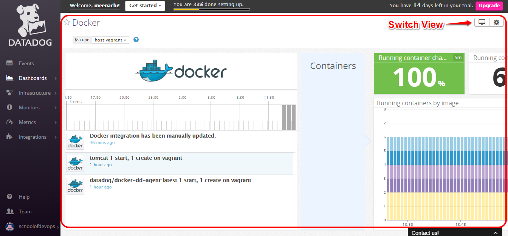

# Monitoring Containers
  In this chapter we are going to monitor logs from container. This can be achieved by using the various monitoring tools, we use

    * ELK Stack - Log Monitoring
    * Prometheus Stack - Application Monitoring
    * Papertrail - Cloud-hosted log management
    * Datadog - Cloud Monitoring as a Service  

## ELK Stack  
* Clone the following repository  
```
https://github.com/vijayboopathy/devops-demos.git
```  
* Install Docker Compose by using the **Docker_compose_installation.sh** script  
* After that, run *Elk_Script.sh* script  
* This will set up the ELK stack for us  
* You can access ELK's web interface (*kibana*) at http://YourIP:5601  
* Since we have not defined the Logstash source, we will get the following screen  
  
* In order to define Logstash source, we need to run the tomcat containers with the following flag.
```
docker run -d -p 8888:8080 -v /home/ubuntu/tomcat-users.xml:/usr/local/tomcat/conf/tomcat-users.xml --log-driver=syslog --log-opt syslog-address=tcp://LogstashIP:5000 tomcat
```  
* If you are exporting logs to Logstash successfully, you will get the following screen  
  
* Then click on *Discover* to see the logs.  


## Prometheus  
* Some knowledge on Prometheus is needed to understand how this stack works.
* From the same repo, run **Prometheus.sh** script  
* This script will set up Prometheus stack  
* Access the dashboard(*Grafana*) on http://YourIP:3000  
* Access credentials are  
```
user: admin
password: foobar
```  
* Click the Grafana Menu at the top left corner (looks like a fireball)  
* Click Data Sources  
* Click the green button Add Data Source.  
  
* In order to monitor application metrics from tomcat containers, we need to run **cadvisor** container on the nodes which also runs tomcat containers (The host which runs tomcat containers)  
* To run cadvisor,  
```
sudo docker run   --volume=/:/rootfs:ro   --volume=/var/run:/var/run:rw   --volume=/sys:/sys:ro   --volume=/var/lib/docker/:/var/lib/docker:ro   --publish=9090:8080   --detach=true   --name=cadvisor google/cadvisor:latest
```  
* To add Tomcat container host as a target, edit prometheus/prometheus/prometheus.yml file

### Install Dashboard
* To see the metrics on Grafana, you need to install the custom dashboard.  
* Simply download the dashboard and select from the Grafana menu -> Dashboards -> Import  
* [Download Dashboard](https://grafana.net/dashboards/179)  
* After configuring everything, the dashboard will look like the following image.  

## Papertrail

* Go to https://papertrailapp.com/signup?plan=free

* Sign up for the service

  

* Once sign up choose `Add a system`

  

* This is the URL to which we will ship the logs. Copy the URL for using in rsyslog configuration

  

  _Note: Url will be different for you_

### Setting up Logspout Container

To send logs from applications running in a Docker container, we use a small container developed by [gliderlabs](https://hub.docker.com/r/gliderlabs/logspout/)

To start a logspout container, run: [Reference](http://help.papertrailapp.com/kb/configuration/configuring-centralized-logging-from-docker/)

    docker run --restart=always -d -p 80:80\
      -v=/var/run/docker.sock:/var/run/docker.sock gliderlabs/logspout  \
      syslog://logs4.papertrailapp.com:10656

Replace `logs4.papertrailapp.com:10656` with one of your Papertrail log destinations.

Now this contaner run in a background with port mapping 80:80.

### Monitoring logs

* Once there is an entry for log in other container starts, Logspout Container helps to collect the logs from various Containers to papertrail automatically.

* Visit `Dashboard` in [papertrail](https://papertrailapp.com/dashboard).

  

* Click `All Systems` from Dashboard to view and edit the setings of various systems _(in our case containers)_.

  

  Change the name of each system with respect to container for easy understanding.

* Click `Events` to monitor logs.

  

### Creating an Alert

* To create an alert based on log, `search` for the entry and `Save Search`.

  

* `Save Search` will open a dialog in which you can choose a name and click `Save and Setup an Alert`

  

* It will redirect to page in which you can choose various forms of alert like mail, hipchat, slack, campfire, etc...

  

* Once the settings are provided and created an alert, settings are saved and we can Update, delete and modify the search.

  

## Verifying an alert

* We get an alert in mail once the query based on our search is occurred.

  

  

## Datadog

* Signup for a 14 day trial account in [datadog](https://app.datadoghq.com/signup)

  

#### Installation

  * Once signup login to the console choose `Integrations` --> `Agent` in it then proceed with installing for Ubuntu to monitor host.

    

    Use this command to install a `datadog agent` in host using a script.

    ```
    DD_API_KEY=1ba0c0a88c3dcf52b076886045f47a8c bash -c "$(curl -L https://raw.githubusercontent.com/DataDog/dd-agent/master/packaging/datadog-agent/source/install_agent.sh)"
    ```

    Once it is done after few minutes the datadog agent will start monitoring host.

    You can stop monitoring by stopping the agent by running the following command.

        sudo /etc/init.d/datadog-agent stop

  * To monitor containers again from console choose `Integrations` --> `Agent` in it then proceed with installing docker container to monitor other containers.

    

    Use this command to install a `datadog docker-dd-agent` in host.

    ```
    docker run -d --name dd-agent -h `hostname` -v /var/run/docker.sock:/var/run/docker.sock -v /proc/:/host/proc/:ro -v /sys/fs/cgroup/:/host/sys/fs/cgroup:ro -e API_KEY=1ba0c0a88c3dcf52b076886045f47a8c datadog/docker-dd-agent:latest
    ```

#### Monitoring

  * Once it is done after few minutes the datadog agent will start monitoring host and other containers.

  * We can monitor this from console by visiting `Infrastructure` and choosing the `Hostname`.

    

  * Datadog monitoring other containers can be viewed by clicking the `inspect` from hostname.

    

  * It will open a dialog in which you can choose docker dashboard to view the complete monitoring report of docker.

    

  * By choosing docker dashboard, will open up new page displaying the complete information about other containers.

    

----

:point_right: [**Next** Chapter 14: Docker Hub Registry](https://github.com/schoolofdevops/learn-jenkins/blob/master/manuscript/140_deploy_application_to_docker_swarm_cluster.md)
